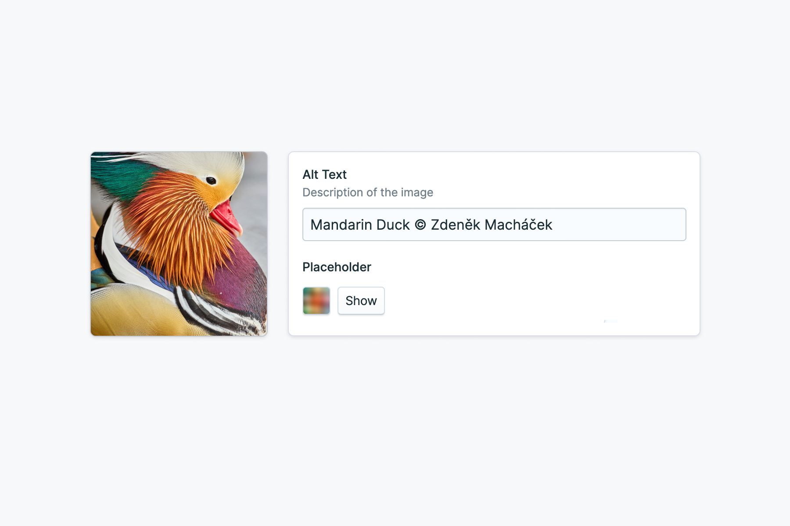
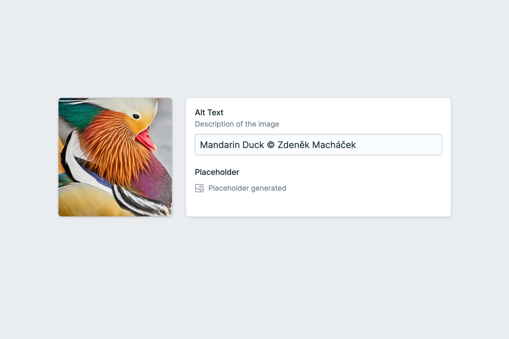

# Statamic Placeholder Images

**Generate image placeholders of Statamic assets for smoother lazyloading.**

## How It Works

The addon ships with a **Placeholder Image** fieldtype and will automatically generate a small blurry
placeholder image for each asset with this fieldtype in its blueprint. In your frontend views, you
can access the image placeholder as a data URI string to display while the high-quality image is
loading.

## Placeholder Types

The addon supports generating various types of image placeholders. The recommended type is `ThumbHash` which encodes most detail and supports transparent images.

- [**ThumbHash**](https://evanw.github.io/thumbhash/) is a newer algorithm with improved color rendering and support for transparency
- [**BlurHash**](https://blurha.sh/) is the original algorithm which has no support for alpha channels and will render transparency in black
- **Average Color** calculates the average color of the image

## Installation

Run the below command from your project root. Alternatively, you can search for this addon in the
`Tools > Addons` section of the Statamic control panel and install it from there.

```sh
composer require daun/statamic-placeholders
```

## Configuration

The config of the package will be published to `config/placeholders.php` on installation. In there,
you can set the default placeholder type, define whether placeholders are generated on upload or
on demand, set a custom queue driver, etc.

## Add a Placeholder Field

Add a new `placeholder` field to the blueprint of each asset container your want to generate
placeholders for. Whenever a new image is uploaded to a container with this field in its blueprint,
it will generate a placeholder. The title and handle of the field can be chosen freely:
`placeholder`, `lqip`, `thumbhash` ...

```diff
# resources/blueprints/assets/assets.yaml

fields:
  -
    handle: alt
    field:
      type: text
      display: Alt
+ -
+   handle: placeholder
+   field:
+     type: placeholder
+     display: Placeholder
```

The field will display a small placeholder preview in the asset edit form. Clicking the placeholder
will reveal details about it like type, size and hash.



You can disable the preview and show a short status message instead by adjusting the field config.

```diff
# resources/blueprints/assets/assets.yaml

fields:
  -
    handle: placeholder
    field:
      type: placeholder
      display: Placeholder
+     show_preview: false
```



## Choose a Placeholder Type

### Default Placeholder Type

By default, the addon will generate ThumbHash placeholders for all placeholder fields. Change the
placeholder provider in `config/placeholders.php`, e.g. if you prefer BlurHash placeholders:

```php
return [
    'default_provider' => 'blurhash'
];
```

### Field Placeholder Type

To override the placeholder type for a specific field while keeping the default for other fields,
you can set it on the field config:

```diff
# resources/blueprints/assets/assets.yaml

fields:
  -
    handle: placeholder
    field:
      type: placeholder
      display: Placeholder
+     placeholder_type: blurhash
```

## Display Placeholders in Your Frontend

In your frontend templates, you can access the placeholder from the name of the new placeholder
field. Assuming you've called it `placeholder` like in the example above, this is how you would
render the placeholder.

### Markup

```antlers
{{ asset url="/assets/image.jpg" }}
  <figure>
    
    
  </figure>
{{ /asset }}
```

### Styling

```css
figure,
figure img {
  position: relative;
}
figure img[aria-hidden='true'] {
  position: absolute;
  top: 0;
  left: 0;
  width: 100%;
  height: 100%;
  object-fit: cover;
}
```

## Configure Generation on Upload

Placeholders are generated on upload so they're ready to go when displaying a page. If you'd rather
generate them on demand, you can configure that behavior in `config/placeholders.php`:

```php
return [
    'generate_on_upload' => false
];
```

## Generate Placeholders for Existing Assets

For existing assets that were uploaded before the field was added, their placeholders will be
generated on request, i.e. whenever they are displayed in the frontend. To speed things up a bit,
you can generate any missing placeholders for existing assets by running the following command:

```sh
php please placeholders:generate
```

## Queueing

If your site is configured to use queues, the placeholders will also be generated asynchronously
using your configured queue driver. If required, you can specify a custom queue and driver in
`config/placeholders.php`
