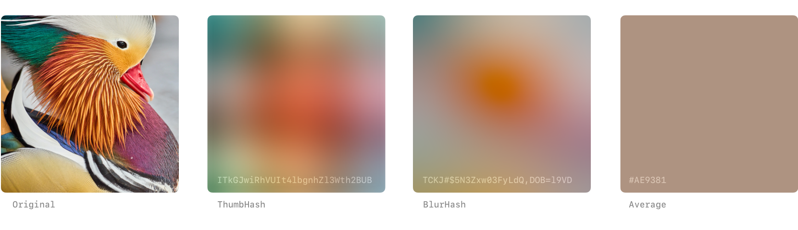

# Statamic Placeholder Images

<!--  -->

**Generate image placeholders of Statamic assets for smoother lazyloading.**

Low-Quality Image Placeholders (LQIP) improve the perceived performance of sites by showing a small
blurry placeholder image while the high-quality version is loading and are often used in combination
with progressive lazyloading.

## Features

- Create blurry image placeholders for assets
- Choose between ThumbHash, BlurHash, and Average Color placeholders
- Generate placeholders on upload, or optionally on demand
- Console commands for batch generation

## How It Works

The addon ships with a **Placeholder Image** fieldtype and will automatically generate a small blurry
placeholder image for each asset with this fieldtype in its blueprint. In your frontend views, you
can access the image placeholder as a data URI string to display while the high-quality image is
loading.

## Quick Start

1. Install using `composer require daun/statamic-placeholders`
2. Add a `placeholder` field to your asset blueprint → `assets.yaml`
3. Display placeholder data uris using the `{{ placeholder }}` field inside an `{{ asset }}` tag

## Documentation

Read the [documentation](./DOCUMENTATION.md) for a detailed guide to setting up and configuring the addon.

## License

[MIT](https://opensource.org/licenses/MIT)
